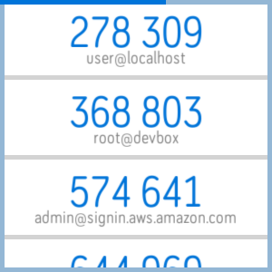

# fitbit-authenticator

Authenticator application to generate TOTP codes on FitbitOS.

 

This app currently supports storing up to 10 tokens. Each token is submitted in the form `name:key` and must have a unique name. TOTP calculations and secrets storage have been moved to the watch, there have been some software improvements but you may still experience a delay upon regeneration of the tokens (~6 seconds at 10 tokens). In exchange you are no longer required to be near/connected to your phone when retreiving tokens on the watch. The phone is still required for token management. Upon submission of the secret key the data is submitted to and stored on the watch with a stripped down name list remaining on the phone for visible settings. New tokens submitted via settings are sent to the watch via Fitbit's [Messaging API](https://dev.fitbit.com/build/reference/companion-api/messaging/). 

If the app is uninstalled all associated data is removed. *Please do not use this as your sole source of accessing these MFA tokens*

Configuration is offered for changing the color, changing the font, displaying a text-based counter and enabling an always-on display.
The settings also support removal and re-order of the tokens.

## Speeding Things up on the Watch

There have been enough software improvements to move calculations to the watch without causing an application crash, however we can get more speed! In pursuit of this I've opened up a [feature request](https://community.fitbit.com/t5/Feature-Suggestions/Device-crypto-support/idi-p/2677127) on the Fitbit forums. If you'd like to see this please vote!

# Fitbit App 

Get it [here](https://gam.fitbit.com/gallery/app/ff58cce2-1f9d-4a2f-917d-3cb70c11b542)!

# Support

If you experience any issues please feel free to create an issue. If you'd prefer to email me you can do so [here](mailto:lixxiadev@gmail.com).

# Changelog

For a list of all changes please click [here](CHANGELOG.md).

# References

- jsSHA-1 library used from [js-sha1](https://github.com/emn178/js-sha1)
- TOTP generation code adapted from [this blogpost](http://blog.tinisles.com/2011/10/google-authenticator-one-time-password-algorithm-in-javascript/)
- Fitbit example project [sdk-bart](https://github.com/Fitbit/sdk-bart)
- Settings file transfer code from [fitbit-file-transfer-settings](https://github.com/KiezelPay/fitbit-file-transfer-settings)

